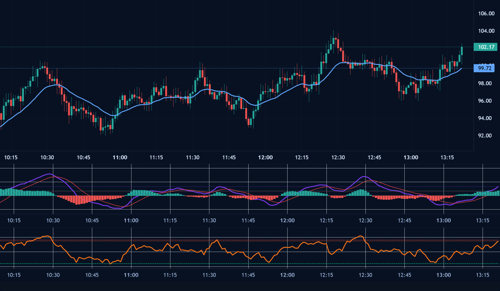

# hitrade

本项目为使用 `lightweight-charts` 仿 TradingView 基本功能的演示页面（纯前端静态文件）。

文件:
- `chart.html` — 主页面（打开此文件即可预览）
- `main.js` — demo 逻辑：生成示例数据、渲染蜡烛图、成交量、SMA/EMA、MACD、RSI、布林带、绘图与导出
- `styles.css` — 样式

快速使用：
1. 在本地打开 `chart.html`（双击或通过浏览器打开文件）。
2. 使用顶部控件切换周期、开启 SMA/EMA/MACD/RSI/布林带、启用绘图并在图上画直线，点击“导出 PNG”下载当前视图截图。

依赖（通过 CDN 引入）:
- lightweight-charts
- html2canvas（用于导出截图）

新增指标:
- MACD: 快速 EMA(12)、慢速 EMA(26)、信号线 EMA(9) 及直方图
- RSI: 14 周期
- 布林带: 20 周期，2 标准差

说明:
- 该 demo 使用随机生成数据来模拟行情，适合作为功能验证或二次开发起点。
- 若需自定义参数或添加更多绘图工具（趋势线、矩形、文本等），我可以继续扩展。
